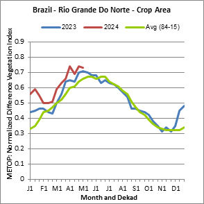

# Triibo-NDVI
> *personal project - explore spatial data, NDVI and agroforestry system efficiency*

The objective of this project is to apply different techniques using GIS and Python to find if the implementation of Triibo in 2018, an agroforestry farm in North of Brazil, did improve the NDVI in the region. 

### Road map

1. Get Landsat 8 data from GloVis for the area of São Miguel Do Gostoso, where the farm Triibo is located.
2. Import data on GIS and manipulate data to get the Area of Interest (AOI), which is the surrounding of Triibo Land
     - Compose Landsat 8 band
     - Draw polygones and extract data
     - Prepare and export data for Python manipulation
6. Analysis of the NDVI evolution accross the years
7. Create GIF animation

### Data

**Location:** São Miguel Do Gostoso, Rio Grande Do Norte, Brazil

**Cloud Cover:** <5%

**Date range:** 2014 - 2024

**Period:** May - July (pick the month with the highest number of scene)

The period is important has the NDVI can be heavily impacted according to the region and the season (rainy/dry season)

Find here more information about NDVI, region and period: [FAO|EarthObservation_Brazil](https://www.fao.org/giews/earthobservation/country/index.jsp?code=BRA)

### Reference 

* Extract data and manipulate data on GIS: [https://youtu.be/yv6-yTxT3Ys?feature=shared](https://youtu.be/yv6-yTxT3Ys?feature=shared)
* Calculate NDVI with Python: [https://youtu.be/dw2aNRvC5Ts?feature=shared](https://youtu.be/dw2aNRvC5Ts?feature=shared)
* Create an GIF animation of the timeseries NDVI: [https://youtu.be/KoLAlcBv290?feature=shared](https://youtu.be/KoLAlcBv290?feature=shared)

