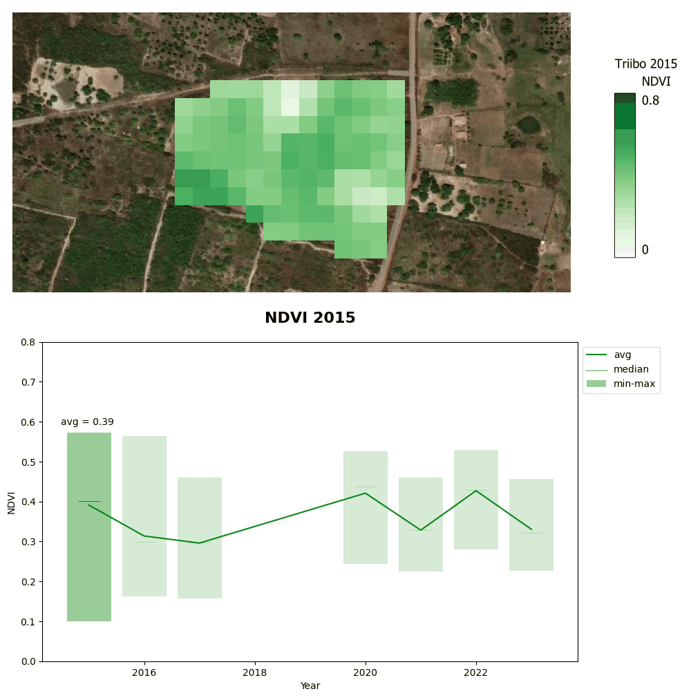

# Triibo-NDVI
> *personal project - Spatial analysis of NDVI evolution using QGIS for agroforestry implementation. 🌱*

The objective of this project is to use QGIS to extract data from satellite imagery and Python to analyze whether the implementation of an agroforestry farm improves the NDVI in the region.

     

### History
[Triibo](https://www.instagram.com/triibo.smg?utm_source=ig_web_button_share_sheet&igsh=ZDNlZDc0MzIxNw==) is a 6-hectare farm located in the North of Brazil, in the state of Rio Grande do Norte. Triibo practices Agroecological Agroforestry Systems (regenerative agriculture) and permaculture with a dual objective: producing food ecologically and regenerating soil and vegetation. The farm began its activities in 2018, and the entire 6 hectares are not yet fully exploited. Previously, this land was used for intensive monoculture farming with heavy machinery, pesticides, and artificial fertilizers, resulting in biodiversity loss and soil degradation. I stayed on this farm for 3 weeks, helping with daily activities such as planting banana trees, harvesting manioc (aipim), eating mangoes, and drinking coconut water. Seeing pictures of the land before Triibo implemented an agroforestry system, I wondered if these efforts could be seen from the sky!

Let's investigate... 🔍

### Road map

1. Get Landsat 8 data from Earth Explorer for the area of São Miguel Do Gostoso, where the farm Triibo is located.
2. Import data on QGIS, manipulate and extract data for Triibo Land
     - Compose Landsat 8 band (Build virtual raster)
     - Calculate and create NDVI layer (Raster Calculator)
     - Draw polygones and extract data (Extraction)
     - Generate zonal statistics on Triibo Land (Extractor)
     - Prepare and export data for Python manipulation
3. Dataset cleaning operations
4. Generate plot of NDVI evolution
5. Combine NDVI plots and satellite imagery
6. Make a GIF!

### Data

Landsat 8, an American satellite, captures land data using the Operational Land Imager (OLI) and the Thermal Infrared Sensor (TIRS) to measure visible, near-infrared, shortwave infrared light, and land surface temperatures. It provides 15-meter panchromatic and 30-meter multi-spectral images across a 185 km swath (the strip of the Earth's surface that a satellite or aerial sensor can capture in a single pass), completing an Earth orbit every 99 minutes with a 16-day repeat cycle.

**Source:** [Earth Explorer](https://earthexplorer.usgs.gov/)

**Location:** São Miguel Do Gostoso, Rio Grande Do Norte, Brazil

**Cloud Cover:** <5%

**Date range:** 2014 - 2024

**Period:** May - July (pick the month with the highest number of scene)

The period is important has the NDVI can be heavily impacted according to the region and the season (rainy/dry season)

Find here more information about NDVI, region and period: [FAO|EarthObservation_Brazil](https://www.fao.org/giews/earthobservation/country/index.jsp?code=BRA)

### Reference 

* Extract data and manipulate data on GIS: [https://youtu.be/yv6-yTxT3Ys?feature=shared](https://youtu.be/yv6-yTxT3Ys?feature=shared)
* Calculate NDVI with Python: [https://youtu.be/dw2aNRvC5Ts?feature=shared](https://youtu.be/dw2aNRvC5Ts?feature=shared)
* Create an GIF animation of the timeseries NDVI: [https://youtu.be/KoLAlcBv290?feature=shared](https://youtu.be/KoLAlcBv290?feature=shared)
